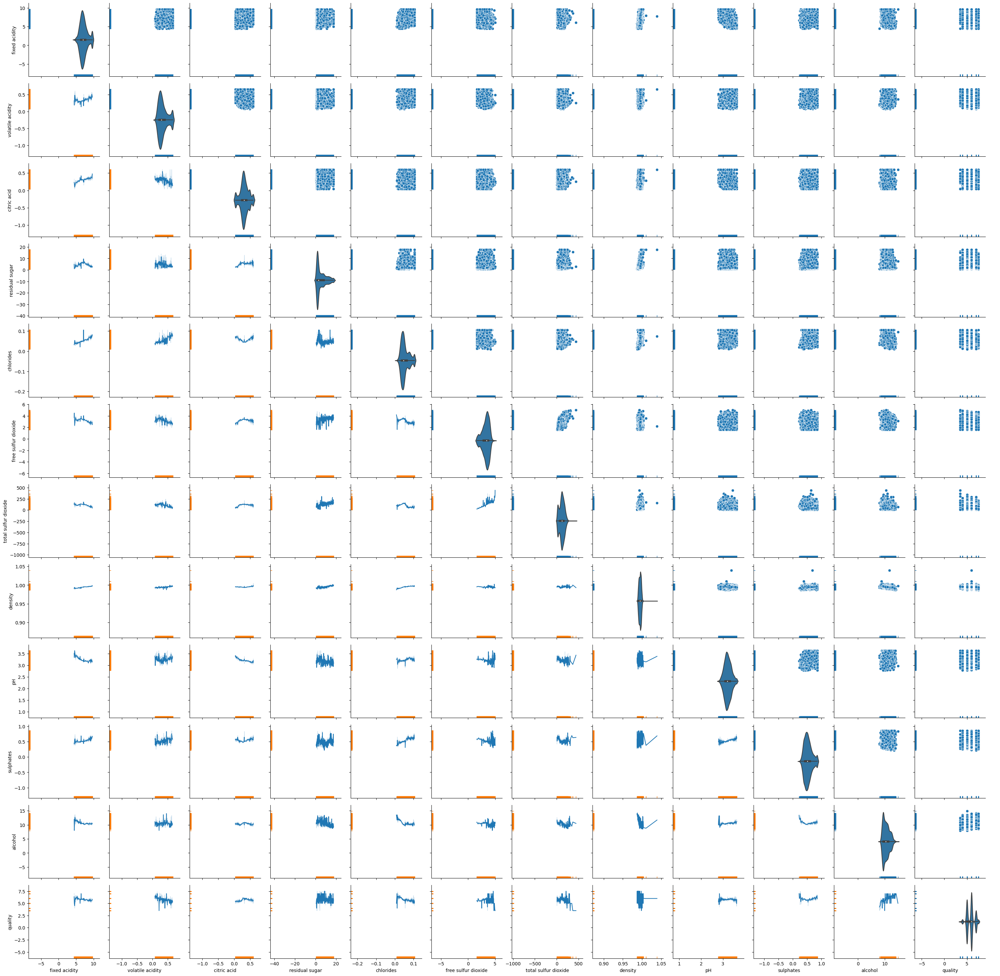

<div style="position: absolute; top: 0; right: 0;">
    <a href="ertugrulbusiness@gmail.com"></a>
    <a href="https://tr.linkedin.com/in/ertu%C4%9Fruldemir?original_referer=https%3A%2F%2Fwww.google.com%2F"></a>
    <a href="https://github.com/ertugruldmr"></a>
    <a href="https://www.kaggle.com/erturuldemir"></a>
    <a href="https://huggingface.co/ErtugrulDemir"></a>
    <a href="https://stackoverflow.com/users/21569249/ertu%c4%9frul-demir?tab=profile"></a>
    <a href="https://medium.com/@ertugrulbusiness"></a>
    <a href="https://www.youtube.com/channel/UCB0_UTu-zbIsoRBHgpsrlsA"></a>
</div>

# Wine Quality Classification
 
## __Table Of Content__
- (A) [__Brief__](#brief)
  - [__Project__](#project)
  - [__Data__](#data)
  - [__Demo__](#demo) -> [Live Demo]()
  - [__Study__](#problemgoal-and-solving-approach) -> [Colab]()
  - [__Results__](#results)
- (B) [__Detailed__](#Details)
  - [__Abstract__](#abstract)
  - [__Explanation of the study__](#explanation-of-the-study)
    - [__(A) Dependencies__](#a-dependencies)
    - [__(B) Dataset__](#b-dataset)
    - [__(C) Pre-processing__](#c-pre-processing)
    - [__(D) Exploratory Data Analysis__](#d-exploratory-data-analysis)
    - [__(E) Modelling__](#e-modelling)
    - [__(F) Saving the project__](#f-saving-the-project)
    - [__(G) Deployment as web demo app__](#g-deployment-as-web-demo-app)
  - [__Licance__](#license)
  - [__Connection Links__](#connection-links)

## __Brief__ 

### __Project__ 
- This is a __classification__ project that uses the  [__Wine Quality Dataset__](https://www.kaggle.com/datasets/rajyellow46/wine-quality) to __predict the wine quality class__.
- The __goal__ is build a model that accurately __predict the wine quality class__  based on the features. 
- The performance of the model is evaluated using several  __metrics__, including _accuracy_, _precision_, _recall_, and _F1 score_.

#### __Overview__
- This project involves building a machine learning model to classify wine qualities based on their features. The dataset contains 6497 records. The target variable has 7 (3 to 9 score) classes. The project uses Python and several popular libraries such as Pandas, NumPy, and Scikit-learn.
#### __Demo__

<div align="left">
  <table>
    <tr>
    <td>
        <a target="_blank" href="" height="30">[Demo app] HF Space</a>
      </td>
      <td>
        <a target="_blank" href="">[Demo app] Run in Colab</a>
      </td>
      <td>
        <a target="_blank" href="">[Traning pipeline] source on GitHub</a>
      </td>
    <td>
        <a target="_blank" href="">[Traning pipeline] Run in Colab</a>
      </td>
    </tr>
  </table>
</div>


- Description
    - __predict The House Price__  based on features.
    - __Usage__: Set the feature values through sliding the radio buttons then use the button to predict.
- Embedded [Demo]() window from HuggingFace Space
    

<iframe
	src=""
	frameborder="0"
	width="850"
	height="450"
></iframe>

#### __Data__
- The [__Wine Quality Dataset__](https://www.kaggle.com/datasets/rajyellow46/wine-quality) from kaggle platform.
- The dataset contains 13 features, all the features are numerical.
- The dataset contains the following features:


<table>
<tr><th>Data Info </th></tr>
<tr><td>


| Input variables (based on physicochemical tests): | 
| ------------------------------------------------- | 
| 1 - fixed acidity                                |
| 2 - volatile acidity                            |                                         
| 3 - citric acid                                 |                                         
| 4 - residual sugar                              |                                         
| 5 - chlorides                                   |                                         
| 6 - free sulfur dioxide                         |                                         
| 7 - total sulfur dioxide                        |                                         
| 8 - density                                     |                                         
| 9 - pH                                          |                                         
| 10 - sulphates                                  |                                         
| 11 - alcohol                                    |                                         
| 12 - quality                                    |  

</td></tr> </table>

<table>
<tr><th>Data Info </th></tr>
<tr><td>


| Column                | Non-Null Count | Dtype    |
| --------------------- | -------------- | -------- |
| type                  | 6497 non-null | object   |
| fixed acidity         | 6487 non-null | float64  |
| volatile acidity      | 6489 non-null | float64  |
| citric acid           | 6494 non-null | float64  |
| residual sugar        | 6495 non-null | float64  |
| chlorides             | 6495 non-null | float64  |
| free sulfur dioxide   | 6497 non-null | float64  |
| total sulfur dioxide  | 6497 non-null | float64  |
| density               | 6497 non-null | float64  |
| pH                    | 6488 non-null | float64  |
| sulphates             | 6493 non-null | float64  |
| alcohol               | 6497 non-null | float64  |
| quality               | 6497 non-null | int64    |

</td></tr> </table>

<table>
<tr><th>Stats </th></tr>
<tr><td>


|                   column                    |   count   |    mean    |    std     |    min     |    25%     |    50%     |    75%     |    max     |
|---------------------------------------------|----------|------------|------------|------------|------------|------------|------------|------------|
|              fixed acidity                 |   6497   |  7.143446  |  1.065338  |   4.450000 |   6.400000 |   7.000000 |   7.700000 |   9.650000 |
|           volatile acidity                  |   6497   |  0.332638  |  0.144277  |   0.080000 |   0.230000 |   0.290000 |   0.400000 |   0.655000 |
|                citric acid                  |   6497   |  0.316262  |  0.131776  |   0.040000 |   0.250000 |   0.310000 |   0.390000 |   0.600000 |
|              residual sugar                 |   6497   |  5.408818  |  4.613286  |   0.600000 |   1.800000 |   3.000000 |   8.100000 |   17.550000 |
|                 chlorides                   |   6497   |  0.053238  |  0.021285  |   0.009000 |   0.038000 |   0.047000 |   0.065000 |   0.105500 |
|           free sulfur dioxide               |   6497   |  3.269919  |  0.647363  |  1.619425  |  2.890372  |  3.401197  |  3.737670  |  5.008616  |
|          total sulfur dioxide               |   6497   | 115.744574 | 56.521855  |   6.000000 |  77.000000 | 118.000000 | 156.000000 |  440.000000 |
|                   density                   |   6497   |  0.994697  |  0.002999  |  0.987110  |  0.992340  |  0.994890  |  0.996990  |  1.038980  |
|                      pH                     |   6497   |  3.217533  |  0.157747  |  2.795000  |  3.110000  |  3.210000  |  3.320000  |  3.635000  |
|                 sulphates                   |   6497   |  0.526614  |  0.131151  |  0.220000  |  0.430000  |  0.510000  |  0.600000  |  0.855000  |
|                  alcohol                    |   6497   | 10.491801  |  1.192712  |  8.000000  |  9.500


</td></tr> </table>


<div style="text-align: center;">
    
</div>


#### Problem, Goal and Solving approach
- This is a __classification__ problem  that uses the a bank dataset [__Wine Quality Dataset__](https://www.kaggle.com/datasets/rajyellow46/wine-quality)  from kaggle to __predict the wine quality score class__ based on 13 features, 2 features are categorical and 11 features are numerical typed.
- The __goal__ is to build a model that accurately __predict the wine quality score class__ based on the features.
- __Solving approach__ is that using the supervised machine learning models (linear, non-linear, ensemly).

#### Study
The project aimed predict the wine quality score classes using the features. The study includes following chapters.
- __(A) Dependencies__: Installations and imports of the libraries.
- __(B) Dataset__: Downloading and loading the dataset.
- __(C) Pre-processing__: It includes data type casting, transformation, missing value handling, outlier handling.
- __(D) Exploratory Data Analysis__: Univariate, Bivariate, Multivariate anaylsises. Correlation and other relations. 
- __(E) Modelling__: Model tuning via GridSearch on Linear, Non-linear, Ensemble Models.  
- __(F) Saving the project__: Saving the project and demo studies.
- __(G) Deployment as web demo app__: Creating Gradio Web app to Demostrate the project.Then Serving the demo via huggingface as live.

#### results
- The final model is __xgbr regression__ because of the results and less complexity.
<div style="flex: 50%; padding-left: 80px;">

|            | MaxError   | MeanAbsoluteError | MeanAbsolutePercentageError | MSE          | RMSE         | MAE          | R2          | ExplainedVariance |
|----------- |-----------|------------------|-----------------------------|-------------|-------------|-------------|-------------|-------------------|
| xgbr      | 10.5| 1.35         | 9.260301                   | 7.800392| 2.792918| 1.966667| 0.909766   | 0.914817          |


</div>


- Model tuning results are below.

<table>
<tr><th>Linear Model</th></tr>
<tc><td>

|          | MaxError | MeanAbsoluteError | MeanAbsolutePercentageError | MSE  | RMSE | MAE       | R2       | ExplainedVariance |
| -------- | --------| -----------------| --------------------------- | ---- | ---- | --------- | -------- | ----------------- |
| lin_reg  | 0.775306| 3.272549          | 19.551373                   | 12.3 | 2.7  | 15.484242| 0.773833| 4.421693          |
| l1_reg   | 12.3    | 2.7               | 15.484242                   | 19.551373 | 4.421693 | 3.272549| 0.773833| 0.775306     |
| l2_reg   | 12.3    | 2.7               | 15.484242                   | 19.551373 | 4.421693 | 3.272549| 0.773833| 0.775306     |
| enet_reg | 12.3    | 2.7               | 15.484242                   | 19.551373 | 4.421693 | 3.272549| 0.773833| 0.775306     |


</td><td> </table>


<table>
<tr><th>Non-Linear Model</th></tr>
<tc><td>

| Model | MaxError | MeanAbsoluteError | MeanAbsolutePercentageError | MSE | RMSE | MAE | R2 | ExplainedVariance |
| --- | --- | --- | --- | --- | --- | --- | --- | --- |
| knn_reg | 24.0 | 2.10 | 14.729846 | 30.463137 | 5.519342 | 3.464706 | 0.647607 | 0.662414 |
| svr_reg | 16.5 | 1.65 | 12.464594 | 13.441569 | 3.666274 | 2.550980 | 0.844510 | 0.851877 |
| dt_params | 13.5 | 2.20 | 13.343018 | 12.810196 | 3.579133 | 2.694118 | 0.851813 | 0.852981 |

</td><td> </table>


<table>
<tr><th>Ensemble Model</th></tr>
<tc><td>

| Model        | MaxError | MeanAbsoluteError | MeanAbsolutePercentageError | MSE       | RMSE      | MAE       | R2        | ExplainedVariance |
|--------------|----------|-------------------|------------------------------|-----------|-----------|-----------|-----------|-------------------|
| bag_reg      | 11.5     | 1.50              | 10.273731                    | 8.372941  | 2.893603  | 2.135294  | 0.903143  | 0.906935          |
| rf_reg       | 10.5     | 1.50              | 10.086696                    | 8.096471  | 2.845430  | 2.094118  | 0.906341  | 0.908946          |
| gbr          | 10.0     | 1.50              | 10.155048                    | 9.614118  | 3.100664  | 2.141176  | 0.888785  | 0.894613          |
| xgbr         | 10.5     | 1.35              | 9.260301                     | 7.800392  | 2.792918  | 1.966667  | 0.909766  | 0.914817          |
| lgbm_reg     | 12.0     | 1.65              | 10.433434                    | 10.045490 | 3.169462  | 2.305882  | 0.883795  | 0.889463          |
| catboost_reg | 11.0     | 1.45              | 9.494598                     | 9.008235  | 3.001372  | 2.119608  | 0.895794  | 0.904287          |


</td><td> </table>


## Details

### Abstract
- [__Wine Quality Dataset__](https://www.kaggle.com/datasets/rajyellow46/wine-quality) is used to predict the wine quality score class. The dataset has 6497 records, 13 features, 2 features are categorical and 11 features are numerical typed. The problem is supervised learning task as regression. The goal is predicting  the wine quality score class through using supervised machine learning algorithms such as non-linear, ensemble and similar model.The study includes creating the environment, getting the data, preprocessing the data, exploring the data, modelling the data, saving the results, deployment as demo app. Training phase of the models implemented through cross validation and Grid Search model tuning approachs. Hyperparameter tuning implemented Greedy Greed Search approach which tunes a hyper param at once a time while iterating the sorted order according the importance of the hyperparams. Models are evaluated with cross validation methods using 5 split. Classification results collected and compared between the models. Selected the basic and more succesful model. Tuned __lgbm regression__ model has __1060.35__ RMSE , __752.01__ MAE, __0.6093__ R2, __0.6093__ Explained Variance, the other metrics are also found the results section. Created a demo at the demo app section and served on huggingface space.  

### File Structures

- File Structure Tree
```bash
├── demo_app
│   ├── app.py
│   ├── component_configs.json
│   ├── examples.pkl
│   ├── requirements.txt
│   └── xgbr_model.sav
├── docs
│   └── images
├── env
│   ├── env_installation.md
│   └── requirements.txt
├── LICENSE
├── readme.md
└── study.ipynb
```
- Description of the files
  - demo_app/
    - Includes the demo web app files, it has the all the requirements in the folder so it can serve on anywhere.
  - demo_app/component_configs.json :
    - It includes the web components to generate web page.
  - demo_app/examples.pkl
    - It includes example cases to run the demo.
  - demo_app/xgbr_model.sav:
    - The trained (Model Tuned) model as pickle (python object saving) format.
  - demo_app/requirements.txt
    - It includes the dependencies of the demo_app.
  - docs/
    - Includes the documents about results and presentations
  - env/
    - It includes the training environmet related files. these are required when you run the study.ipynb file.
  - LICENSE.txt
    - It is the pure apache 2.0 licence. It isn't edited.
  - readme.md
    - It includes all the explanations about the project
  - study.ipynb
    - It is all the studies about solving the problem which reason of the dataset existance.    


### Explanation of the Study
#### __(A) Dependencies__:
  -  There is a third-parth installation which is kaggle dataset api, just follow the study codes it will be handled. The libraries which already installed on the environment are enough. You can create an environment via env/requirements.txt. Create a virtual environment then use hte following code. It is enough to satisfy the requirements for runing the study.ipynb which training pipeline.
#### __(B) Dataset__: 
  - Downloading the  [__Wine Quality Dataset__](https://www.kaggle.com/datasets/rajyellow46/wine-quality) via kaggle dataset api from kaggle platform. The dataset has 6497  records. There are 13 features, 2 features are categorical and 11 features are numerical. For more info such as histograms and etc... you can look the '(D) Exploratory Data Analysis' chapter.
#### __(C) Pre-processing__: 
  - The processes are below:
    - Preparing the dtypes such as casting the object type to categorical type.
    - Missing value processes: Finding the missing values then handled with filling mean value, for futher studies the other predictive imputations are added but not used.
    - Transformation: changing the variable value range to normalize the distibution.
    - Outlier analysis processes: uses  both visual and IQR calculation apporachs. According to IQR approach, detected statistically significant outliers are handled using boundary value casting assignment method.

      <div style="text-align: center;">
          
      </div>
 
#### __(D) Exploratory Data Analysis__:
  - Dataset Stats
<table>
<tr><th>Data Info </th><th><div style="padding-left: 50px;">Stats</div></th></tr>
<tr><td>

| Column                | Non-Null Count | Dtype    |
| --------------------- | -------------- | -------- |
| type                  | 6497 non-null | object   |
| fixed acidity         | 6487 non-null | float64  |
| volatile acidity      | 6489 non-null | float64  |
| citric acid           | 6494 non-null | float64  |
| residual sugar        | 6495 non-null | float64  |
| chlorides             | 6495 non-null | float64  |
| free sulfur dioxide   | 6497 non-null | float64  |
| total sulfur dioxide  | 6497 non-null | float64  |
| density               | 6497 non-null | float64  |
| pH                    | 6488 non-null | float64  |
| sulphates             | 6493 non-null | float64  |
| alcohol               | 6497 non-null | float64  |
| quality               | 6497 non-null | int64    |

</td><td>

<div style="flex: 50%; padding-left: 50px;">


|                   column                    |   count   |    mean    |    std     |    min     |    25%     |    50%     |    75%     |    max     |
|---------------------------------------------|----------|------------|------------|------------|------------|------------|------------|------------|
|              fixed acidity                 |   6497   |  7.143446  |  1.065338  |   4.450000 |   6.400000 |   7.000000 |   7.700000 |   9.650000 |
|           volatile acidity                  |   6497   |  0.332638  |  0.144277  |   0.080000 |   0.230000 |   0.290000 |   0.400000 |   0.655000 |
|                citric acid                  |   6497   |  0.316262  |  0.131776  |   0.040000 |   0.250000 |   0.310000 |   0.390000 |   0.600000 |
|              residual sugar                 |   6497   |  5.408818  |  4.613286  |   0.600000 |   1.800000 |   3.000000 |   8.100000 |   17.550000 |
|                 chlorides                   |   6497   |  0.053238  |  0.021285  |   0.009000 |   0.038000 |   0.047000 |   0.065000 |   0.105500 |
|           free sulfur dioxide               |   6497   |  3.269919  |  0.647363  |  1.619425  |  2.890372  |  3.401197  |  3.737670  |  5.008616  |
|          total sulfur dioxide               |   6497   | 115.744574 | 56.521855  |   6.000000 |  77.000000 | 118.000000 | 156.000000 |  440.000000 |
|                   density                   |   6497   |  0.994697  |  0.002999  |  0.987110  |  0.992340  |  0.994890  |  0.996990  |  1.038980  |
|                      pH                     |   6497   |  3.217533  |  0.157747  |  2.795000  |  3.110000  |  3.210000  |  3.320000  |  3.635000  |
|                 sulphates                   |   6497   |  0.526614  |  0.131151  |  0.220000  |  0.430000  |  0.510000  |  0.600000  |  0.855000  |
|                  alcohol                    |   6497   | 10.491801  |  1.192712  |  8.000000  |  9.500


</div>

</td></tr> </table>
  - Variable Analysis
    - Univariate analysis, 
      <div style="text-align: center;">
          
           
          
      </div>
    - Bivariate analysis
      <div style="text-align: center;">
          
          
          
          
          
          
      </div>
    - Multivariate analysis.
      <div style="text-align: center;">
          
          
          
      </div>
  - Other relations.
    <div style="display:flex; justify-content: center; align-items:center;">
      <div style="text-align: center;">
      <figure>
      <p>Correlation</p>
      
      </figure>
      </div>
      <div style="text-align: center;">
      <figure>
      <p>Variance</p>
      
      </figure>
      </div>
      <div style="text-align: center;">
      <figure>
      <p>Covariance</p>
      
      </figure>
      </div>
    </div>

#### __(E) Modelling__: 
  - Data Split
    - Splitting the dataset via  sklearn.model_selection.train_test_split (test_size = 0.2).
  - Util Functions
    - Greedy Step Tune
      - It is a custom tuning approach created by me. It tunes just a hyperparameter per step using through GridSerchCV. It assumes the params ordered by importance so it reduces the computation and time consumption.  
    - Model Tuner
      - It is an abstraction of the whole training process. It aims to reduce the code complexity. It includes the corss validation and GridSerachCV approachs to implement training process.
    - Learning Curve Plotter
      - Plots the learning curve of the already trained models to provide insight.
  - Linear Model Tuning Results
    - linear, l1, l2, enet regressions
    - Cross Validation Scores
      | Model     | MaxError | MeanAbsoluteError | MeanAbsolutePercentageError | MSE      | RMSE     | MAE      | R2       | ExplainedVariance |
      | --------- | -------- | ----------------- | --------------------------- | -------- | -------- | -------- | -------- | ----------------- |
      | lin_reg   | 0.17709  | 0.532308          | 0.635385                    | 2.0      | 0.0      | inf      | 0.17694  | 0.79711           |
      | l1_reg    | 2.0      | 0.0               | inf                         | 0.637692 | 0.798556 | 0.533077 | 0.173951 | 0.173970          |
      | l2_reg    | 3.0      | 0.0               | inf                         | 0.669231 | 0.818065 | 0.533846 | 0.133097 | 0.163146          |
      | enet_reg  | 2.0      | 0.0               | inf                         | 0.639231 | 0.799519 | 0.536154 | 0.171958 | 0.172020          |
    - Feature Importance
      <div style="display:flex; justify-content: center; align-items:center;">
          
          
      </div>
    - Learning Curve
      <div style="display:flex; justify-content: center; align-items:center;">
          
          
      </div>
  - Non-Linear Models
    - Logistic Regression, Naive Bayes, K-Nearest Neighbors, Support Vector Machines, Decision Tree
    - Cross Validation Scores _without balanciy process_
      |        | accuracy | precision | recall   | f1_score |
      |--------|----------|-----------|----------|----------|
      | loj_reg    | 0.540769 | 0.540769  | 0.540769 | 0.540769 |
      | nb_params | 0.498462 | 0.498462  | 0.498462 | 0.498462 |
      | knn        | 0.633846 | 0.633846  | 0.633846 | 0.633846 |
      | dt         | 0.612308 | 0.612308  | 0.612308 | 0.612308 |
	
    - Feature Importance
      <div style="display:flex; justify-content: center; align-items:center;">
          
      </div>
    - Learning Curve
      <div style="display:flex; justify-content: center; align-items:center;">
          
      </div>

  - Ensemble Models
    - Random Forest, Gradient Boosting Machines, XGBoost, LightGBoost, CatBoost
    - Cross Validation Scores _without balanciy process_
      |       | accuracy | precision | recall   | f1_score |
      |-------|----------|-----------|----------|----------|
      | rf    | 0.682308 | 0.682308  | 0.682308 | 0.682308 |
      | gbc   | 0.622308 | 0.622308  | 0.622308 | 0.622308 |
      | xgbc  | 0.651538 | 0.651538  | 0.651538 | 0.651538 |
      | lgbm  | 0.669231 | 0.669231  | 0.669231 | 0.669231 |
      | cb    | 0.623846 | 0.623846  | 0.623846 | 0.623846 |
    - Feature Importance
      <div style="display:flex; justify-content: center; align-items:center;">
          

      </div>
    - Learning Curve
      <div style="display:flex; justify-content: center; align-items:center;">
          
      </div>

#### __(F) Saving the project__: 
  - Saving the project and demo studies.
    - trained model __xgbr_model.sav__ as pickle format.
#### __(G) Deployment as web demo app__: 
  - Creating Gradio Web app to Demostrate the project.Then Serving the demo via huggingface as live.
  - Desciption
    - Project goal is predicting the sales price based on four features.
    - Usage: Set the feature values through sliding the radio buttons and dropdown menu then use the button to predict.
  - Demo
    - The demo app in the demo_app folder as an individual project. All the requirements and dependencies are in there. You can run it anywhere if you install the requirements.txt.
    - You can find the live demo as huggingface space in this [demo link]() as full web page or you can also us the [embedded demo widget](#demo)  in this document.  
    
## License
- This project is licensed under the Apache 2.0 License. See the [LICENSE](LICENSE) file for details.

<h1 style="text-align: center;">Connection Links</h1>

<div style="text-align: center;">
    <a href="ertugrulbusiness@gmail.com"></a>
    <a href="https://tr.linkedin.com/in/ertu%C4%9Fruldemir?original_referer=https%3A%2F%2Fwww.google.com%2F"></a>
    <a href="https://github.com/ertugruldmr"></a>
    <a href="https://www.kaggle.com/erturuldemir"></a>
    <a href="https://huggingface.co/ErtugrulDemir"></a>
    <a href="https://stackoverflow.com/users/21569249/ertu%c4%9frul-demir?tab=profile"></a>
    <a href="https://www.hackerrank.com/ertugrulbusiness"></a>
    <a href="https://app.patika.dev/ertugruldmr"></a>
    <a href="https://medium.com/@ertugrulbusiness"></a>
    <a href="https://www.youtube.com/channel/UCB0_UTu-zbIsoRBHgpsrlsA"></a>
</div>

